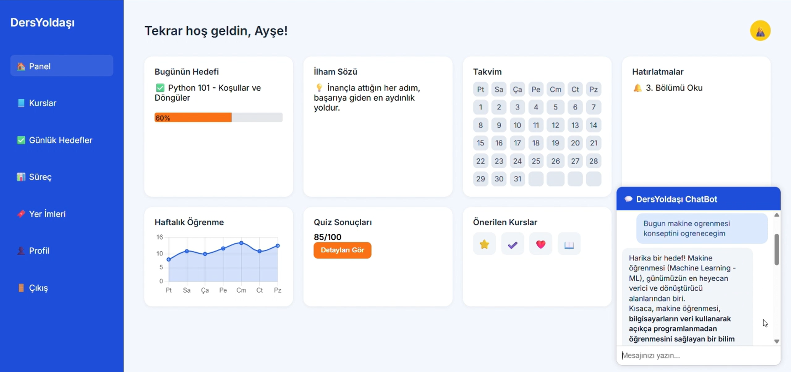
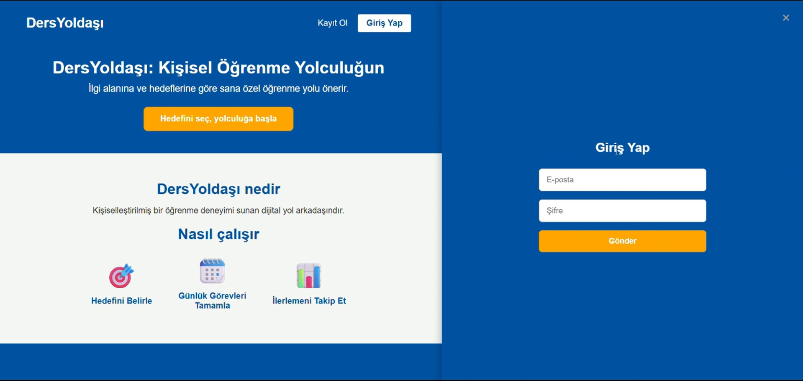
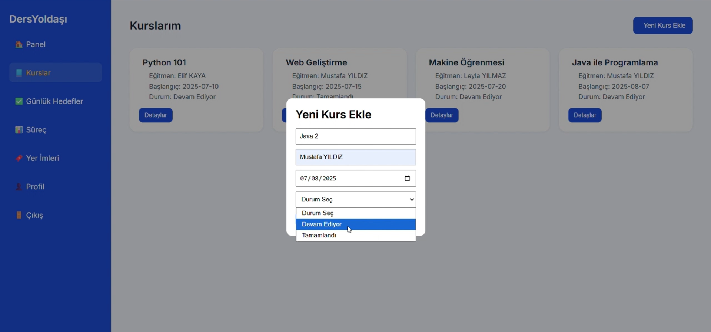
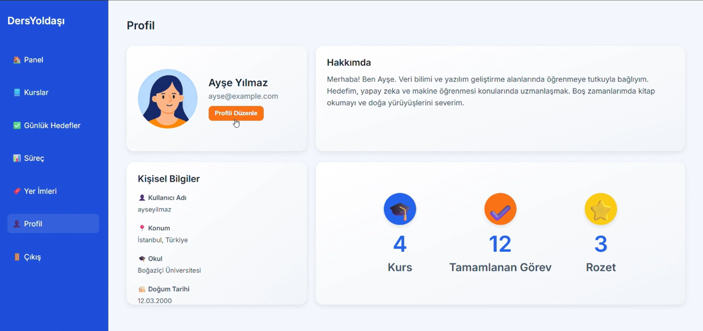
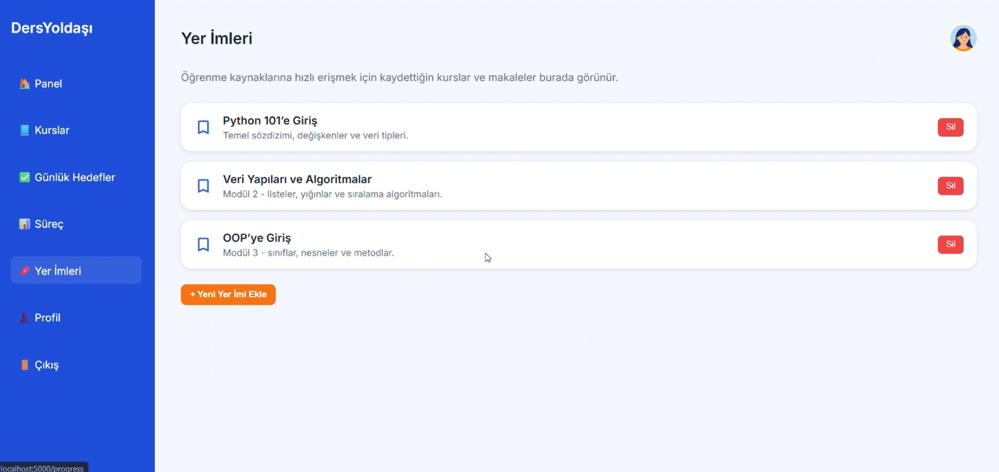
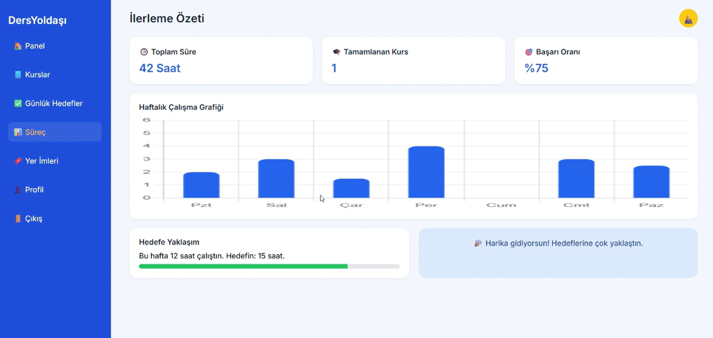
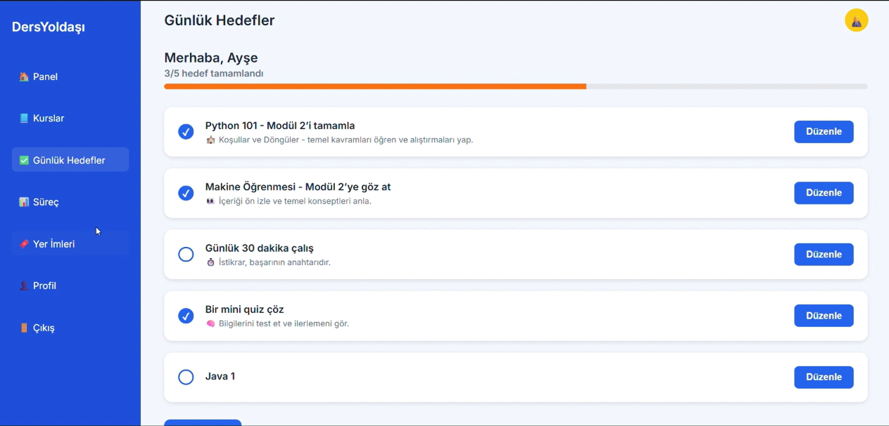

# 🎓 Ders Yoldaşı – BTK Hackathon 2025

  

---

## 🚀 Proje Hakkında

**Ders Yoldaşı**, BTK Hackathon 2025 için geliştirdiğimiz yapay zekâ destekli dijital öğrenme asistanıdır.  
6 gün gibi kısa bir sürede, ekip arkadaşım ile birlikte kullanıcıların eğitim yolculuklarını daha planlı, motive edici ve verimli hale getirmek için tasarladık.

---

## 🎯 Hedeflerimiz

- Bireylerin dijital eğitim süreçlerinde **kişiselleştirilmiş hedefler** sunmak  
- İlerlemeyi kolayca takip etmek ve **motivasyon sağlamak**  
- Gemini API ile yapay zekâ destekli **anlık öneriler ve sohbet botu** oluşturmak  

---

## 🧠 Öne Çıkan Özellikler

| Özellik                 | Açıklama                                                    |  
|------------------------|-------------------------------------------------------------|  
| ✅ Kurs ve modül takibi | Kullanıcıların devam eden ve tamamlanan kurslarını takip eder |  
| ✅ Günlük hedefler      | Kişiselleştirilmiş günlük öğrenme hedefleri önerir          |  
| ✅ İstatistikler       | İlerleme ve başarıyı grafiklerle analiz eder                 |  
| ✅ ChatBot              | Gemini API destekli etkileşimli öğrenme asistanı             |  

---

## 📱 Ekran Görüntüleri

  
  
  
  
  
  
  

---

## 💻 Teknolojiler

| Teknoloji                                                                                           | Açıklama                         |  
|---------------------------------------------------------------------------------------------------|---------------------------------|  
|   | Backend: Flask ile API ve sunucu |  
|    | Frontend: HTML, CSS, JavaScript |  
|  | Yapay Zekâ: Gemini API            |  
|  | Veri Depolama: JSON dosyaları    |  

---

## 📬 Geri Bildirim & Katkı

Projeye katkıda bulunmak ya da geri bildirim vermek isterseniz, lütfen iletişime geçin!

📧 Email: dannyachami01@gmail.com  
🌐 GitHub: [github.com/the15developer](https://github.com/the15developer)  

---

  Projemizi değerlendirdiğiniz için teşekkürler! 🌟

